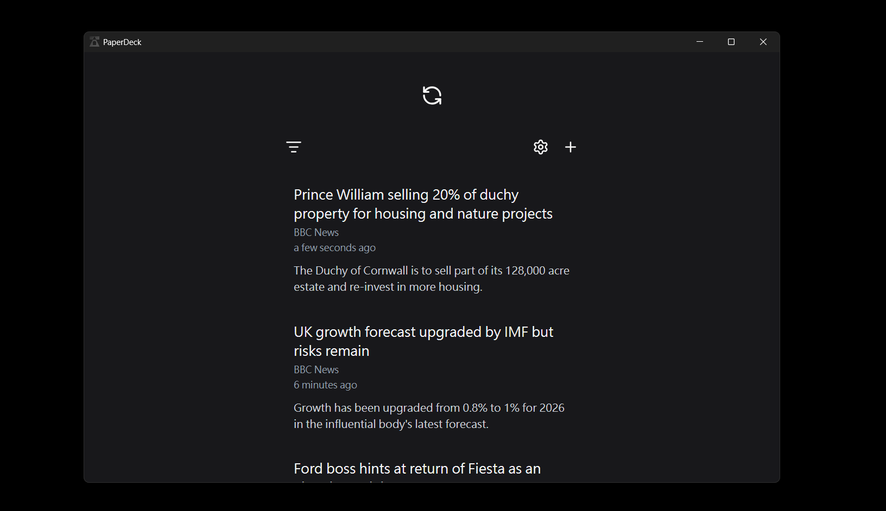
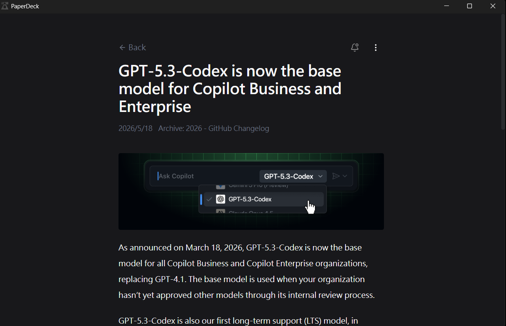

## PaperDeck

PaperDeck is an open-source, local-first RSS/Atom reader.




## Features

- Subscribe to feeds
- Read articles in-app
- Export and import OPML files
- Mark articles as read or unread

## Development

### Prerequisites

- Node.js >= 24
- npm
- Windows or Linux (macOS is not supported yet)

### Setup

Clone the repository:

```sh
git clone https://github.com/PaperDeck/PaperDeck.git
cd PaperDeck
```

Install dependencies:

```sh
npm install
```

Create environment files:

```sh
cp .env.example .env
cp .env.test.example .env.test
```

Run database migrations for the development environment:

> [!NOTE]
> Delete `dev.db` first if it already exists.

```sh
npx drizzle-kit push
```

### Scripts

Run the app in development mode:

```sh
npm run dev
```

Run tests:

```sh
npm test                 # Run all tests
npm run test:unit        # Run unit tests
npm run test:integration # Run integration tests
```

Build the app:

```
npm run build
```

## Tech Stack

- Electron for the desktop application runtime
- React + Vite for the frontend
- TypeScript for type safety
- SQLite with Drizzle ORM for local data storage
- Tailwind CSS and Radix UI for the user interface
- Zustand for state management
- i18next for internationalization
- Vitest for testing

## License

This project is licensed under the [Apache License 2.0](LICENSE).
